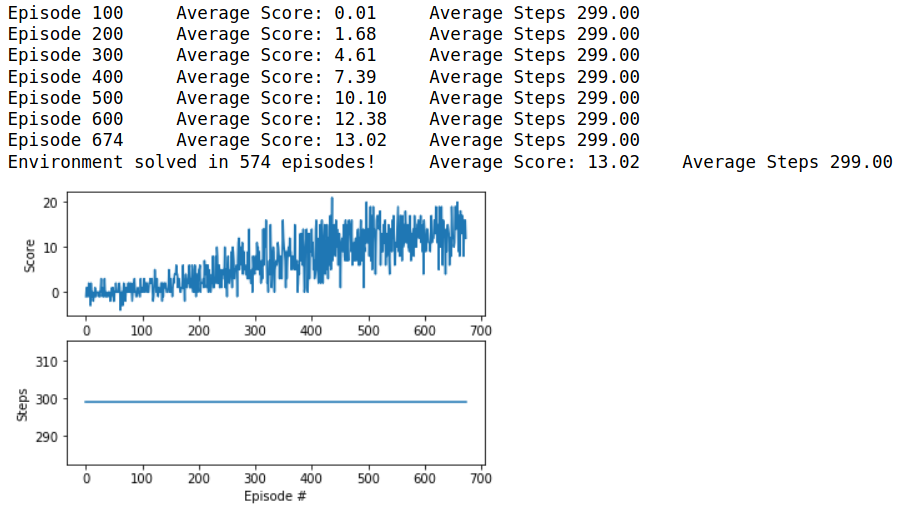

# Udacity Navigation Project Report
Luis Arias

*June 2020*

---

## Learning Algorithm

The algorithms used in this project are a combination of:

- Double DQN (see https://arxiv.org/abs/1509.06461)
- Dueling DQN (see https://arxiv.org/abs/1511.06581)

Double DQN was implemented in the agent's `learn` method (see [`agent.py`](./agent.py)) by predicting actions to be taken using the local network and predicting Q values for the next step using the target network as follows:

```python
        # Use Double DQN: Get predicted actions from local network model
        local_actions = self.qnetwork_local(
            next_states).detach().argmax(dim=1).unsqueeze(1)
        # Get predicted Q values (for next states) from target model using predicted actions
        Q_targets_next = self.qnetwork_target(
            next_states).gather(1, local_actions).detach()

```

Dueling DQN was implemented in the neural network model (see [`model.py`](./model.py)) by splitting the neural network into an advantage head and a value head in the `_init_` method as follows:

```python
        # trunk
        self.fc1 = nn.Linear(state_size, fc1_units)
        self.fc2 = nn.Linear(fc1_units, fc2_units)

        # adv head
        self.adv1 = nn.Linear(fc2_units, head_units)
        self.adv2 = nn.Linear(head_units, action_size)

        # val head
        self.val1 = nn.Linear(fc2_units, head_units)
        self.val2 = nn.Linear(head_units, 1)
```

In the `forward` method, the logits of the two heads are combined according to the Dueling DQN algorithm as follows:

```python
        return val.expand(adv.size()) + adv - adv.mean(dim=1, keepdim=True)
```

### Hyperparameters

Hyperparameters for the neural network model where chosen using the DQN exercise as a guide.  Here the number of units in the linear layers (64) was the square of the environment complexity (8). Thus given that the Banana environment size was reported to be 37, the number of units in the linear layers could have been 1369, however before attempting to use this model size, attempts were made at 768 and 1024 with significantly similar results.  In fact the best results in terms of compute time and number of episodes where actually obtained with 768 units and a peculiar condition where some additional log statements might have had an influence on random number generation by slowing down calculations.

Hyperparameters for the agent were pretty much left as is with respect to the DQN exercise with however an explicit disabling of GPU which was useful when running the notebook locally since the available computer's GPU (a XPS 15 9530) was detected but not supported by Pytorch 0.4 causing a runtime error.

```python
BUFFER_SIZE = int(1e5)  # replay buffer size
BATCH_SIZE = 64         # minibatch size
GAMMA = 0.99            # discount factor
TAU = 1e-3              # for soft update of target parameters
LR = 5e-4               # learning rate
UPDATE_EVERY = 4        # how often to update the network
USE_GPU = False         # override GPU detection
```

## Methods

The approach to implementing these algorithms was to first implement them on a simpler environment, namely the [Deep Q-Network exercise](https://github.com/udacity/deep-reinforcement-learning/tree/master/dqn/exercise) we studied in the Udacity Deep Reinforcement Learning course which uses the [OpenAI Lunar Lander](https://gym.openai.com/envs/LunarLander-v2/) environment.  This approach was important because the higher complexity ML Agents Bananas environment took a prohibitely long amount of compute time to solve on a CPU (6 to 13 hours).  Furthermore, using a High Performance GPU (Tesla V100 · 16 GB Memory - 61 GB RAM · 100 GB SSD) did not significantly improve performance.

The [Prioritized Experience Replay](https://arxiv.org/abs/1511.05952) algorithm was implemented and evaluated on OpenAI's Lunar Lander environment but was not retained for this project because in spite of providing slightly better efficiency in terms of episodes, the additional compute cost could have significantly increased the time to solve the Bananas environment.


## Results



The most succesful run solved the environment in 574 episodes using a model with 768 units and a batch size of 64, again with an implementation of Double DQN and Dueling DQN in the model.  This result was obtained at a moment in the elaboration of this project when an attempt to improve by adjusting the learning rate to the actual number of steps being taken by the agent per episode.  It turned out the the number of steps was actually constant (300 steps per episode).  It was unfortunately not possible to improve on this result whether by using the same exact parameters, different seeds, a larger model, or a different learning rate (higher or lower).  The only remarkable difference between this run and the others was the code involved in tracking and periodically reporting the number of steps per episode.  This is quite unfortunate, since it seems to imply that extraneous factors tied to the computing environment such as additional I/O or additional monitoring computation could be involved in the relative success of a run.

The notebook for this run may be viewed in the commit history of this repository:

https://github.com/kaaloo/udrlnd-p1-navigation/blob/c042a686ff20f2319099fe470da1fabace999e96/Navigation.ipynb

Specifically, the dqn function in that notebook (see below) kept track of the number of steps in each episdoe using the `steps` and `steps_window` arrays.  Additionally, the average number of steps where printed out along with the average score.

```python
def dqn(n_episodes=2000, max_t=1000, eps_start=1.0, eps_end=0.01, eps_decay=0.996):
    """Deep Q-Learning.

    Params
    ======
        n_episodes (int): maximum number of training episodes
        max_t (int): maximum number of timesteps per episode
        eps_start (float): starting value of epsilon, for epsilon-greedy action selection
        eps_end (float): minimum value of epsilon
        eps_decay (float): multiplicative factor (per episode) for decreasing epsilon
    """
    scores = []                        # list containing scores from each episode
    steps = []                         # number of steps needed for each episode
    scores_window = deque(maxlen=100)  # last 100 scores
    steps_window = deque(maxlen=100)   # last 100 number of steps
    eps = eps_start                    # initialize epsilon
    for i_episode in range(1, n_episodes+1):
        env_info = env.reset(train_mode=False)[brain_name] # reset the environment
        state = env_info.vector_observations[0]            # get the current state
        score = 0                                          # initialize the score
        for t in range(max_t):
            action = agent.act(state, eps)
            env_info = env.step(action)[brain_name]        # send the action to the environment
            next_state = env_info.vector_observations[0]   # get the next state
            reward = env_info.rewards[0]                   # get the reward
            done = env_info.local_done[0]                  # see if episode has finished
            agent.step(state, action, reward, next_state, done)
            state = next_state
            score += reward
            if done:
                break
        scores_window.append(score)       # save most recent score
        scores.append(score)              # save most recent score
        steps_window.append(t)
        steps.append(t)

        eps = max(eps_end, eps_decay*eps) # decrease epsilon

        print('\rEpisode {}\tAverage Score: {:.2f}\tAverage Steps {:.2f}'.format(i_episode, np.mean(scores_window), np.mean(steps_window)), end="")
        if i_episode % 100 == 0:
            print('\rEpisode {}\tAverage Score: {:.2f}\tAverage Steps {:.2f}'.format(i_episode, np.mean(scores_window), np.mean(steps_window)))
        if np.mean(scores_window)>=13.0:
            print('\nEnvironment solved in {:d} episodes!\tAverage Score: {:.2f}\tAverage Steps {:.2f}'.format(i_episode-100, np.mean(scores_window), np.mean(steps_window)))
            torch.save(agent.qnetwork_local.state_dict(), 'checkpoint.pth')
            break
    return scores, steps
```

It was also found through running this notebook on FloydHub on CPU and GPU environments that a GPU, even a high-end GPU, did not contribute effectively towards shortening run times.

## Future Work

Several areas to explore could have the potential to improve results and gain a better understanding of why extraneous factors such as those mentioned above could and if they actually do have an influence.  Perhaps this best run was some kind of fluke.  Given the long run times, it was not pratical to investigate this issue further in the context of this work.

Is it possible to do better than 574 episodes ?  Perhaps improving the algorithm by adding prioritized learning or implementing the Rainbow algorithm which mashes together six different algorithms could give better results.  In my results, tweaking hyperparameters both in the algorithm and the model beyond what seems reasonable with respect to the literature describing both the Double DQN and Dueling DQN did not significantly affect performance.  But it may be the case that a more complete search in the hyperparameter space could home in on a more performant set of hyperparameters, perhaps through [Grid Search](https://en.wikipedia.org/wiki/Hyperparameter_optimization#Grid_search) or some other hyperparameter optimization algorithm. The single core nature of the notebook environment used in this work means that it is potentially possible to parallelize this type of process by running variants in N processes where N ~ the number of cores available.
